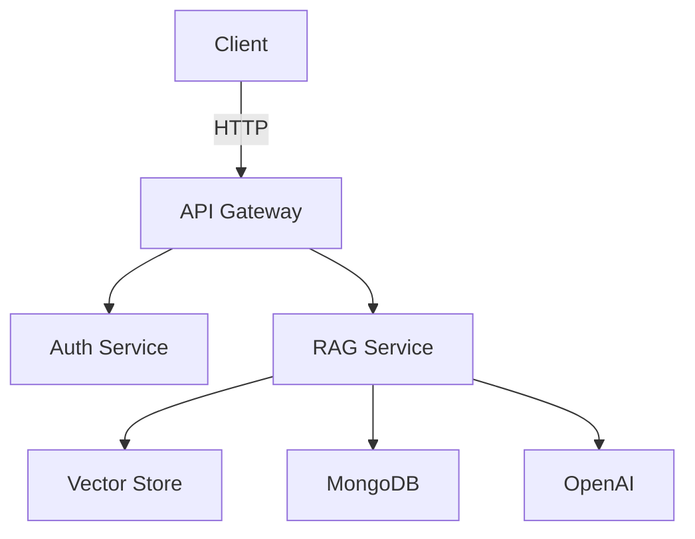

# Architecture

## Microservices

- **Auth Service**: Handles JWT issuance and validation.
- **RAG Service**: Exposes endpoints for document ingestion and querying.
- **Vector Store**: FAISS index for embeddings.
- **Database**: MongoDB storing document metadata.

